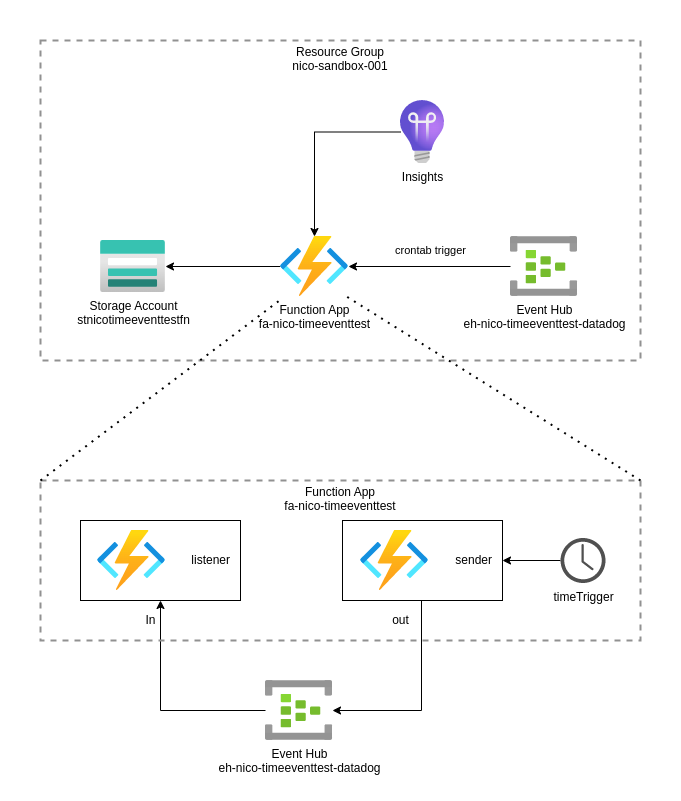

# Deploying Azure Functions using Terraform

> **note**
> This project was cloned from https://github.com/godatadriven/azure_function_terraform after I read [an article](https://godatadriven.com/blog/deploying-an-azure-function-with-terraform/) by [Niels Zeilemaker](https://github.com/NielsZeilemaker). I wanted to experiment myself, and hence cloned the original repository with the idea to adapt it to my own needs.

> **warning**
> This is NOT production code. I use it for educational purposes to explore features in MS Azure. Use at your own risk.

# Lab Description

This is a simple Azure functions application where one Python function is triggered by a timer event which in turn generates a message to send to a listener function via an event hub:



# Testing

You will need an active Azure subscription and appropriate permissions.

Basic steps:

```shell
# Insure you are logged in - below is optional depending on your specific setup
az login

# Init terraform 
terraform init

# Check for potential errors. In te future with updates to Azure, there may be a couple of adjustments needed. Please open PR's if that is the case for you.
terraform plan

# Deploy
terraform apply
```

## Common command to try out

Get the configuration of the function application:

```shell
az functionapp config show --resource-group nico-sandbox-001 --name fa-nico-timeeventtest
```

List the functions in an application:

```shell
az functionapp function list --resource-group nico-sandbox-001 --name fa-nico-timeeventtest
```

Same as listing, but use [jq](https://jqlang.github.io/jq/) to extract the ID's:

```shell
az functionapp function list --resource-group nico-sandbox-001 --name fa-nico-timeeventtest | jq -r ".[].id"
```

## Get the application logs

I found the best way for this deployment was to SSH into the functions application and go to the function logs directly.

There are two ways to accomplish this:

Option 1: Use a web browser: The URL is in the format `https://<app-name>.scm.azurewebsites.net/webssh/host``

Option 2: Use the CLI tool to get an SSH session. Details below:

```shell
# Starts a local SSH proxy
az webapp create-remote-connection --resource-group nico-sandbox-001 --name fa-nico-timeeventtest

# Connect to the local proxy, using the port and credentials as provided by the previous command
ssh -p44375 root@localhost
```

> **warning**
> On Ubuntu or other systems you may get the error `Unable to negotiate with 127.0.0.1 port 44375: no matching cipher found. Their offer: aes128-cbc,3des-cbc,aes256-cbc`. In order to still force a connection using the older cyphers run the command `ssh -p44375 -c 3des-cbc root@localhost`

Once you have an SSH session, you can navigate to the logs, for example:

```shell
cd /home/LogFiles/Application/Functions/Function/listener/
```

